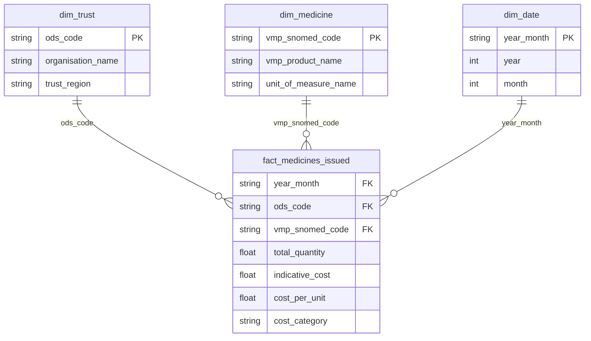

# Week 3 Schema Design - SCMD

## Continuity Check (Task 3.0)
My Week 2 Parquet originally had the source header typo TOTAL_QUANITY_IN_VMP_UNIT and lacked
separate year/month columns. I fixed both at the source by adding a standardize_columns step to
src/transform.py (renaming to TOTAL_QUANTITY_IN_VMP_UNIT and deriving year/month from YEAR_MONTH),
then re-ran the transform. Final row count is 310,344 rows, 12 columns. This differs from the
spec's illustrative 311,072; the difference reflects my own Week 2 cleaning decisions, and I trust
my file over the spec note, as instructed.

## Grain
One row in the fact table = one Trust, one Medicine, one Month.
(Verified in Week 1: zero duplicates on YEAR_MONTH + ODS_CODE + VMP_SNOMED_CODE.)

## Engine Choice: SQLite
I chose SQLite. It needs zero setup, is a single portable file, and is more than enough for one
laptop's worth of monthly SCMD data (~310k rows/month). I would move to PostgreSQL only with a
concrete reason such as concurrent writers or a shared server; there is none at this stage.

## ER Diagram

## Table Definitions

### dim_trust
| Column | Type | Key | Notes |
|---|---|---|---|
| ods_code | TEXT | PK | from ODS_CODE |
| organisation_name | TEXT | | not available yet; deferred to Week 4 |
| trust_region | TEXT | | nullable; deferred to Week 4 |

### dim_medicine
| Column | Type | Key | Notes |
|---|---|---|---|
| vmp_snomed_code | TEXT | PK | from VMP_SNOMED_CODE |
| vmp_product_name | TEXT | | |
| unit_of_measure_name | TEXT | | |

### dim_date
| Column | Type | Key | Notes |
|---|---|---|---|
| year_month | TEXT | PK | e.g. "202605" |
| year | INTEGER | | |
| month | INTEGER | | |

### fact_medicines_issued
| Column | Type | Key | Notes |
|---|---|---|---|
| year_month | TEXT | FK -> dim_date | part of PK |
| ods_code | TEXT | FK -> dim_trust | part of PK |
| vmp_snomed_code | TEXT | FK -> dim_medicine | part of PK |
| total_quantity | REAL | | from TOTAL_QUANTITY_IN_VMP_UNIT |
| indicative_cost | REAL | | |
| cost_per_unit | REAL | | carried from Week 2 |
| cost_category | TEXT | | carried from Week 2 |

Primary key of the fact table: (year_month, ods_code, vmp_snomed_code) - matches the grain.
